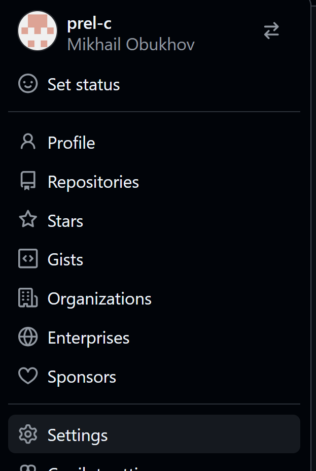

<<<<<<< HEAD
# opd

Repository for the project on opd

Можно использовать Git в:

1. win+r; cmd; wsl - то есть просто в командной строке

2. git bush - приложение-консоль самого git, оно уже стоит у вас на компе, тк у вас стоит git, обычной консоли будет достаточно, но можно и bush\`ем пользоваться

3. можно в PowerShell - командная строка Windows, она почти такая же как и обычная

4. можно открыть терминал в Vs Code и там либо сразу писать и пользоваться, либо wsl и пользоваться уже этим терминалом через wsl (лучше так, тк 1) там у нас уже храниться SHH ключ и обычный Windows его не увидит, поэтому придётся создавать второй 2) в linux меньше будет проблем и всяких странностей пери работе с git

5. Терминал Git в PyCharm открывается нажатием Alt+F12 (или View > Tool Windows > Terminal) - сам не пользовался, не знаю

Выбрать можно любой вариант, это влияет только на удобность вышей работы, PyCharm или Vs Code (с вводом в консоль wsl) как я думаю будут лучшими вариантами.

  

# Регистрация на GitHub

  

У некоторых могут быть проблемы с vpn при регистрации (сам GitHub работает без vpn, но система проверки ботов при регистрации без vpn может не работать)

  

Там по сути ничего сложного, просто регаемся, потом скиньте мне ваш ник, чтобы я назначил вас разработчиком репозитория.

  

# Создание локального репозитория

  

1. Создайте где угодно папку с любым названием (но без русских букв)

2. в терминале cd "путь к папке"

 Далее либо:

`git clone git@github.com:prel-c/opd.git`

 Либо:

 3. `git init` (инициализировать работу git в этой папке)

если будет ошибку выдавать, попробуйте создать любой файл в этой папке, сделать снова 2,3 и потом можно удалять файл

4. `git remote add origin git@github.com:prel-c/opd.git`

5. `git pull origin main`

  

# Настройка

## конфигурация git

  

`git config user.name "Ваше Имя"`

`git config user.email "you@example.com"`

  

## SHH ключ

  

Он у всех уже есть, поэтому

  

`cat ~/.ssh/id_ed25519.pub`

  

и копируем вообще всю строку, далее вставляем её в github:

  

  

Если что-то не так, на крайний случай можно зайти на gitlab и от туда его скопировать.

  

## проверить соединение с GitHub (должно ответить приветствием GitHub)

  

`ssh -T git@github.com`

  

# Переход на свою ветку

  

`git switch "Имя Вашей ветки: Daniel, Petya, Nastya, Roma, Svyat"`

Работать будем каждый в своей ветке, чтобы во время работы не смешивать изменения от разных разработчиков друг с другом. То есть каждый делает свою задачу и когда уже в ней не будет багов и она будет стабильна и минимально работоспособна, то она будет отправляться в ветку main. Далее можно например дополнить что-то в своей ветке, проверить, а потом снова отправить его в main.

  

Чтобы отправить изменения в ветку main: `git push origin main `

Чтобы отправить в свою ветку: `git push origin "название Вашей ветки"`

  

Постарайтесь грамотно писать сообщения в коммите, например что-то в духе: `git commit -m "Add new YOLO model"` - и делать коммиты маленькими.

То есть самый плохой коммит выглядит так: 99999 строк изменены и `git commit -m "something has changed a little"` - тут потом не разобраться где, что поменялось.
=======
test
>>>>>>> c911f487845986a9aa0006730af70e4a7df6a883
