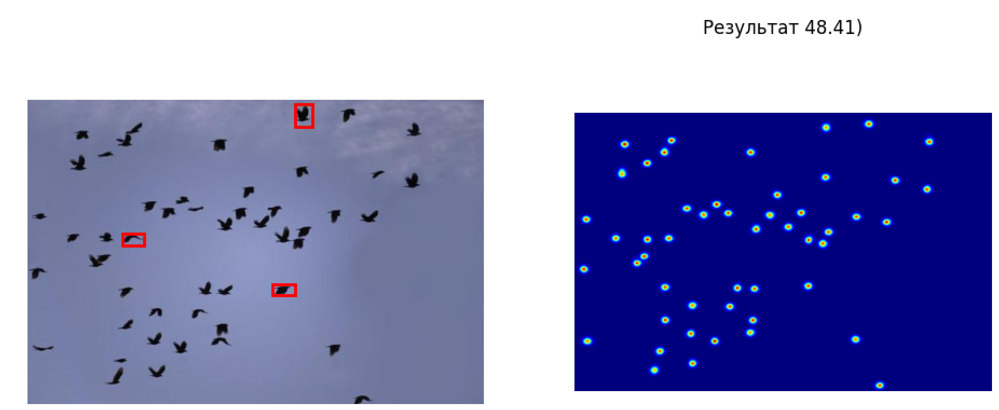

Repository for the computer vision project

## Overview

Проект реализует несколько подходов к подсчету произвольных объектов на изображениях. Подсчет должен быть по объектам любого класса, поэтому нельзя обучать модель на конечном числе классов.
Каждый pipeline использует разные методы компьютерного зрения: классические алгоритмы для подсчета и обработки, предобученные модели для подсчета, сегментации, выделения признаков...
Это позволяет сравнивать точность, скорость и условия работы разных методов.

---

## Pipelines

### 1. Segmentation -> ResNet -> Loca

**Идея:** Модель SAM (Segment Anything Model) или алгоритм Otsu сегментирует изображение для удаления фона и шума, после чего модель ResNet (Residual Network) выделяет признаки на изображениях (используется объединение слоев 2, 3 и 4) и на основе этих признаков предобученная на датасете FSC-147 модель Loca строит карту плотности объектов, сумма которой и дает число объектов на фото.

Шаги:
1. ввод фото
2. выделение 3 примеров
3. сегметация
4. ResNet
5. Loca
6. вывод

**Плюсы:**
- Высокая точность
- работа с фоном
- умеет считать объекты с перекрытиями

**Минусы:**

- долгая работа
- желательно наличие GPU

Пример работы

### 2. Segmentation -> ResNet -> FamNet

**Идея:** Модель SAM (Segment Anything Model) или алгоритм Otsu сегментирует изображение для удаления фона и шума, после чего модель ResNet (Residual Network) выделяет признаки на изображениях (используются 3 и 4 слои) и на основе этих признаков предобученная на датасете FSC-147 модель FamNet строит карту плотности объектов, сумма которой и дает число объектов на фото.
У модели есть режим быстрой адаптации, где она делает 100 градиентных спусков, используя информацию с примеров.  

Шаги:
1. ввод фото
2. выделение хотя бы одного примера
3. выбор режима: c адаптацией или без
4. сегметация
5. ResNet
6. FamNet 
7. Постобработка
8. вывод

**Плюсы:**
- Высокая точность
- работа с фоном

**Минусы:**
- плохая работа со сложным фоном
- плохо считает объекты с перекрытиями
- долгая работа
- желательно наличие GPU

### 3. Classic

**Идея:** это pipeline основанный только на алгоритмах. В основе лежит шаблонный поиск вокруг которого выстроена пред- и постобработка для его корректной работы.

Шаги:
1. ввод фото
2. выделение хотя бы одного примера
3. Гауссово размытие
4. Ядро Собеля
5. Цикл с понижением масштаба шаблона
	1. Шаблонный поиск
	2. Подавление немаксимумов
	3. LBP
6. вывод

**Плюсы:**
- быстрая работа
- не требует GPU

**Минусы:**
- плохая работа со сложным фоном
- плохо считает объекты с перекрытиями

### 4. FamNet

**Идея:** Предобученная на датасете FSC-147 модель FamNet, которая по примерам объектов строит карту плотности. Используется как baseline без дополнительной сегментации и предобработки. Модель имеет режим быстрой адаптации с 100 градиентными спусками.

Шаги:
1. ввод фото
2. выделение 3 примеров
3. выбор режима: с адаптацией или без
4. ResNet (извлечение признаков)
5. FamNet
6. постобработка карты плотности
7. вывод (сумма карты = число объектов)

**Плюсы:**
- простота
- baseline для сравнения

**Минусы:**
- чувствительность к фону
- плохо работает с перекрытиями объектов
- средняя точность (MAE 23.75, RMSE 69.07)

### 5. Loca (базовая)

**Идея:** Модель Loca (Location-aware Counting), предобученная на датасете FSC-147. В отличие от FamNet, Loca лучше учитывает пространственное расположение объектов и корректнее работает с перекрытиями. Используется как сильный baseline без сегментации.

Шаги:
1. ввод фото
2. выделение 3 примеров
3. ResNet (извлечение признаков)
4. Loca
5. построение карты плотности
6. вывод (сумма карты = число объектов)

**Плюсы:**
- высокая точность для базовой модели
- лучше FamNet справляется с перекрытиями
- MAE 11.36 — значительно ниже чем у FamNet

**Минусы:**
- чувствительность к фону и шумам
- требует GPU для приемлемой скорости

### 6. YOLO (обученная на FSC-147)

**Идея:** Детектор YOLO (You Only Look Once), обученный на датасете FSC-147 для задачи обнаружения объектов. В отличие от плотностных моделей (FamNet, Loca), YOLO предсказывает bounding boxes, а затем считает их количество. Этот подход не является few-shot — модель видит только те классы, на которых обучена.

Шаги:
1. ввод фото
2. детекция объектов YOLO
3. фильтрация предсказаний по confidence
4. подавление немаксимумов (NMS)
5. вывод количества bounding boxes

**Плюсы:**
- высокая скорость детекции
- даёт не только число, но и позиции объектов

**Минусы:**
- **не few-shot** — не может считать произвольные объекты без дообучения
- самые низкие метрики (MAE 36.53, RMSE 116.02)
- плохо работает с новыми классами объектов

### 7. SAFECount

**Идея:** SOTA-модель для few-shot object counting. Использует более сложную архитектуру и механизмы внимания для лучшего выделения объектов на сложном фоне. Служит референсным ориентиром для сравнения качества наших пайплайнов.

Шаги:
1. ввод фото
2. выделение примеров
3. извлечение признаков через backbone
4. механизмы внимания для сравнения примеров с изображением
5. построение карты плотности
6. вывод числа объектов

**Плюсы:**
- высокое качество на сложных сценах
- MAE 15.28 — лучше чем FamNet и YOLO
- хорошая работа с перекрытиями

**Минусы:**
- медленная работа
- высокие требования к GPU
- архитектура сложнее для интеграции

### Результаты экспериментов (MAE / RMSE)

| Pipeline | MAE | RMSE |
|----------|-----|------|
| 1. Segmentation + Loca | 8.31 | 37.04* |
| 2. Segmentation + FamNet | 21.04 | 52.31 |
| 3. Классический (наш) | 29.89 | 86.13 | 
| 4. FamNet (baseline) | 23.75 | 69.07 |
| 5. Loca (базовая) | 11.36 | 38.04 |
| 6. YOLO (FSC-147) | 36.53 | 116.02 |
| 7. SAFECount (SOTA) | 15.28 | 47.20 |

---

## Technologies

#### Deep Learning & Models
**PyTorch**. Использовался для работы с тензорами, расчета градиентов и кастомных функций потерь.

**ResNet-50** — сверточная нейронная сеть, используемая в качестве backbone для извлечения признаков (Feature Extraction) из изображений.

**FamNet** — архитектура для формирования карты плотности и few-shot подсчета объектов.

**Segment Anything Model (SAM)**(vit_b) — применена для генерации масок, удаления фона и очистки данных от шума перед подачей в основную сеть.

#### Computer Vision

**OpenCV** — чтение и цветокоррекция изображений, пред- и постобработка, отрисовка bounding boxes для дебага.

**NumPy** — векторизованные операции над изображениями, обработка массивов карт плотности, нормализация...

**Pillow** — загрузка и базовые преобразования изображений при формировании датасетов.

**Алгоритмы**: HOG, LBP, Sobel, Canny, Преобразование Хафа...

#### Data Visualization & Paser
**Matplotlib** — построение карт плотности, наложение масок на оригинальные изображения и вывод.

**tqdm**, **JSON**...

