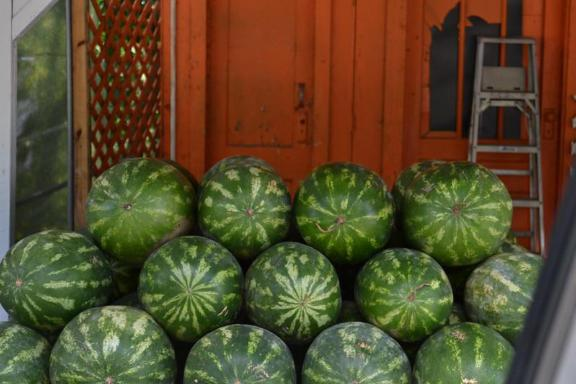
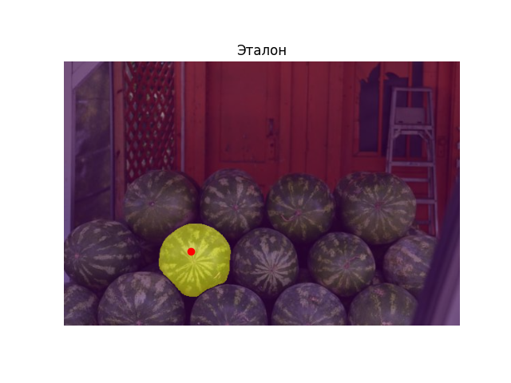
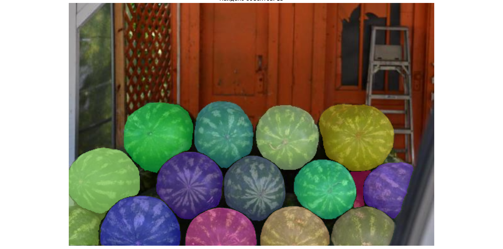
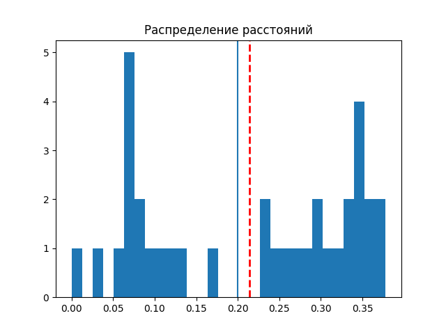

# Подсчёт произвольных предметов с использованием SAM + CLIP

## Инструкция по запуску
 
Для запуска алгоритма необходимо запустить файл:

```bash
python main.py
````

Перед запуском можно указать пути к изображениям в файле `main.py`:

```python
REF_IMAGE = "data/images_384_VarV2/263.jpg"
SCENE_IMAGE = "data/images_384_VarV2/263.jpg"
```

---

## Выбор объекта

После запуска откроется изображение.
Необходимо кликнуть мышью по объекту, который будет использоваться как эталон.

Алгоритм автоматически:

* выделит объект с помощью SAM,
* извлечёт его признаки с помощью CLIP,
* выполнит поиск похожих объектов на изображении.

### Картинка-пример



Рисунок 1 — Исходное изображение

---

## Выделение эталона

После выбора точки алгоритм строит маску объекта и отображает выделенный эталон.



Рисунок 2 — Выделенный объект

---

## Результат поиска

После обработки отображаются найденные похожие объекты.



Рисунок 3 — Результат работы алгоритма

---

## Гистограмма расстояний

Также отображается распределение cosine distances и автоматически вычисленный threshold.



Рисунок 4 — Распределение расстояний

