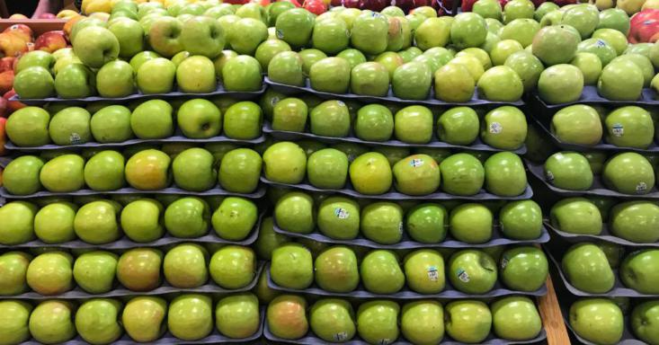
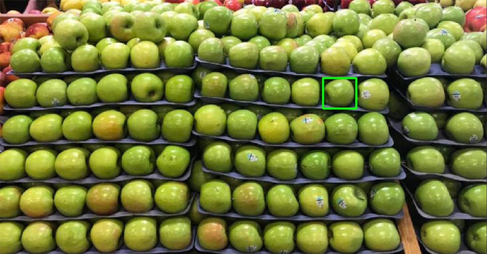
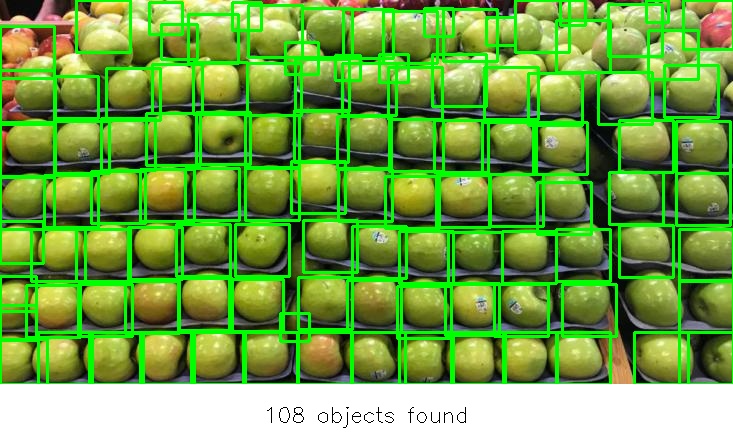

# Алгоритм основанный на классических методах

## Инструкция по запуску

Работа программы сопровождается подсказками в терминале. В случае возникновения проблем можно обратиться к следующему тексту. Для того чтобы запустить алгоритм нужно запустить файл "/Pipeline/main.py". В случае, если вы хотите проверить работу алгоритма не на предложенном изображении (рисунок 1), укажите в терминале после соответсвующего сообщения путь к файлу.

  

Рисунок 1 - Изображение-пример

Далее, после выбора изображения терминал предложит вам выбрать объект-шаблон на изображении (рисунок 2). Для данного метода достаточно одного шаблона, в случае выбора более обного шаблона терминал выдаст сообщение "Ошибка: выделено x прямоугольников, а нужно 1". Если выбранный бокс вас не устраивает можете удалить его с помощью клавиши backspace. После завершения выбора шаблона нажмите Enter.

  

Рисунок 2 - Выбор шаблона

Результат автоматически схраниться в в той же папке, что и исходное изображение под именем "result.jpg". На рисунке 3 приведён пример результата выполнения программы.

  

Рисунок 3 - Результат работы программы

